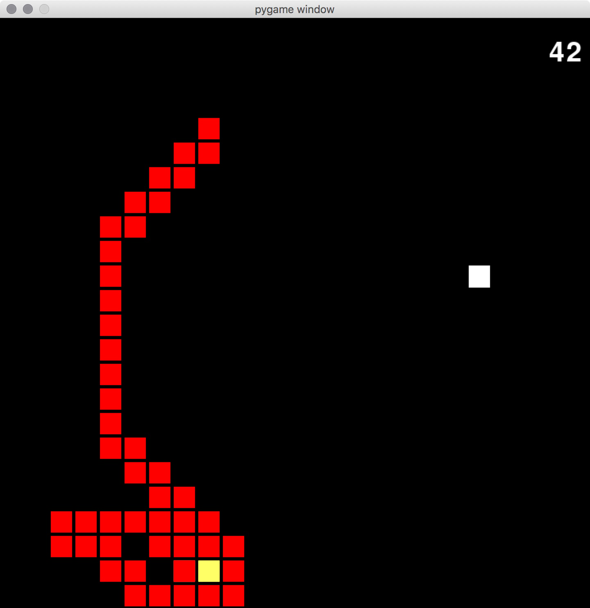

### Dependencies:
- pygame
- tensorflow (evolve_nn_ai.py)
- _ pickle (q_ai.py, evolve_nn_ai.py)

### user_op:
Allows user to play snake using the arrow keys. Second command line arg chooses game period. game period must be at lowest 100 otherwise rendering issues will occur when snake eats food.  
"python3 main.py user_op 300"

### reflex_ai:
Snake chooses actions that put it into a state with a closer Euclidean distance to food, from available actions (actions that do not kill snake through collisions). This AI can be seen as a depth 1 search agent or a reflex agent as it only considers immediate local actions, and risks being 'blocked in' by its own body at large lengths. This can be seen below, with the yellow square highlighting the head:

  

"python3 main.py reflex_ai 100"

### minmax_ai:
The snake performs a depth-3 search on possible actions in order to find the best action, which is the one with minimum Euclidean distance sum. Collisions produce an infinite distance to the food and actions that produce collisions are pruned from the search tree.

### q_ai:
Snake uses a simple reinforcement learning scheme (vanilla Q-learning) to take actions. In this simplest form of Q-learning, the quality function is discretized and approximated with a multidimensional table. To effectively use this table, the state space representation is reduced to an boolean indicating whether the left, right and direct sides of the snake's head are clear, as well as the location of the food, both of which are binned as 1 of 4 regions relative to the snake's head. Decaying epsilon-greedy exploration and temporal difference update approaches were used. A reward function of 25 for getting food, -30 for dying and -1 for living was defined as to push the snake away from infinite looping. Since the environment is deterministic and rewards are sparse, I set a high discount factor (0.99), which should help propogate rewards. A 5000 episode trained model is given in the Q.pickle file.

Initially I included a measure of the center of mass of the snake binned relative to the head similar to the food, but this increased the size of the state space dramatically and I noticed that, after 5000 episodes, less than 25% of the state space was explored, whereas without this feature over 90% of the space is explored. This ai performs quite poorly compared to the reflex_ai and minmax_ai, most likely due to the reduced state space and poor approximation of the Q function. Since increasing the number of features makes convergence intractable a more powerful approximation may be the solution.

### dqn_ai:

Third command line arg chooses whether to load a previously trained Q list or to begin exploring with a blank list.  
"python3 main.py q_ai 100 True"
